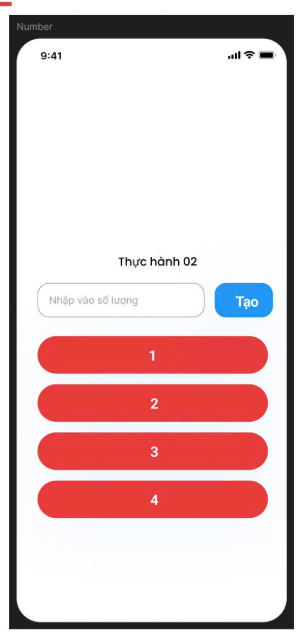
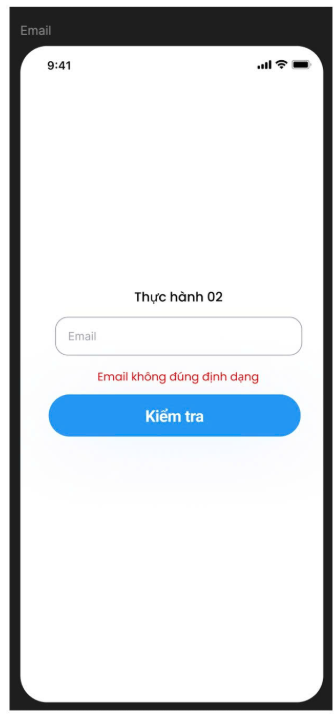
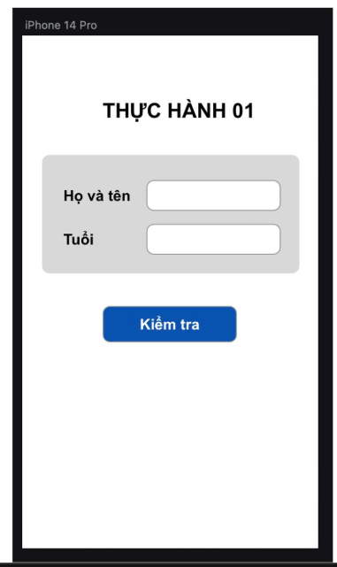

# Tuần 2

## THỰC HÀNH 2.1
Tạo một màng hình đơn giản nhập số 
- Nếu nhập đúng số, tạo ra danh sách
- Nếu không đúng kiểu số -> Thông báo "Dữ liệu nhập không hợp lệ"

## THỰC HÀNH 2.2
Tạo một màng hình đơn giản để nhập email
- Nếu email là null/rỗng -> "Email không hợp lệ"
- Nếu email không chứa @ -> "Email không chứa đúng định dạng"
- Nếu nhập đúng -> "Bạn đã nhập email hợp lệ"

## TUẦN 2
Tạo một màng hình đơn giản để nhập tên và tuổi
sau đó hiển thị thông tin và kiểm tra người đó là

*Người già (>65) | Người lớn (6-65) | trẻ em (2-6) | em bé (<2)*

